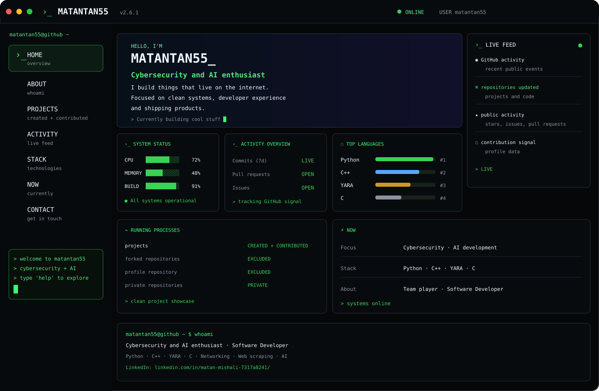

<div align="center">

# MATANTAN55<span>_</span>

**Cybersecurity and AI enthusiast**

`PYTHON`　`C++`　`YARA`　`C`

[](https://github.com/matantan55) [](https://www.linkedin.com/in/matan-mishali-7317a8241/)

</div>

<p align="center">
  
</p>

```text
┌─ MATANOS / PROFILE ─────────────────────────────────────────────────────────┐
│                                                                             │
│  STATUS     ● ONLINE             FOCUS      CYBERSECURITY + AI              │
│  ROLE       SOFTWARE DEVELOPER   STACK      PYTHON · C++ · YARA · C         │
│  MODE       BUILDING             SYSTEM     GREEN / TERMINAL                │
│                                                                             │
└─────────────────────────────────────────────────────────────────────────────┘
```

## `~/about`

> First and foremost, a team player. Believes firmly that **“Teamwork makes the dream work”.** After that a Software Developer.
>
> Fervent to delve in new technologies at every opportunity given.
>
> Specializes at **Cybersecurity in general, Computer networking, Data visualization, Web scraping, AI development, Python and C/C++ programming languages.**

<details>
<summary><strong>▱ PROJECTS</strong>　<code>created + contributed</code></summary>

Projects are intended to represent work I actually own or contributed code to.

`✓ CREATED`　`✓ CONTRIBUTED`　`✗ FORKS`　`✗ PROFILE REPO`　`✗ PRIVATE`

**Live MatanOS project view →** [OPEN DASHBOARD](https://matantan55.github.io/matantan55/)

</details>

<details>
<summary><strong>⌁ ACTIVITY</strong>　<code>github signal</code></summary>

<p align="center">

[](https://github.com/matantan55)

</p>

<p align="center">

[](https://github.com/matantan55)

</p>

</details>

<details>
<summary><strong>◇ STACK</strong>　<code>primary technologies</code></summary>

| | Stack |
|:---|:---|
| `01` | **Python** |
| `02` | **C++** |
| `03` | **YARA** |
| `04` | **C** |
| `05` | Cybersecurity · Networking |
| `06` | AI · Data Visualization · Web Scraping |
| `07` | Linux · Git · Automation |

</details>

<details>
<summary><strong>ϟ NOW</strong>　<code>current process</code></summary>

```text
matantan55@github ~ $ now

> exploring cybersecurity + AI
> building systems & security tooling
> diving into new technologies
> shipping things worth showing

● process active
```

</details>

<details>
<summary><strong>›_ TERMINAL</strong>　<code>interactive-style commands</code></summary>

```text
matantan55@github ~ $ whoami
Cybersecurity and AI enthusiast

matantan55@github ~ $ stack
Python · C++ · YARA · C

matantan55@github ~ $ status
● ONLINE

matantan55@github ~ $ open matanos
→ https://matantan55.github.io/matantan55/
```

</details>

<div align="center">

### `✉ CONTACT`

[**GITHUB**](https://github.com/matantan55)　·　[**LINKEDIN**](https://www.linkedin.com/in/matan-mishali-7317a8241/)

<br>

`MATANTAN55 // GREEN SYSTEM`　`v2.6.1`

</div>
