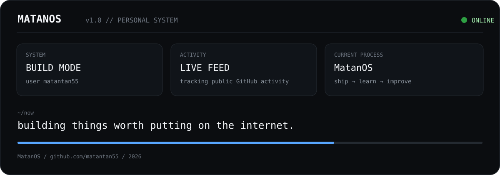

<!--
  matantan55 // terminal profile
  The dashboard above is the visual interface. GitHub renders README markdown,
  so the interface is intentionally built as a responsive SVG rather than JS.
-->

`ABOUT` · `PROJECTS` · `ACTIVITY` · `STACK` · `NOW` · `CONTACT`

### `~/about`

I build things that live on the internet — focused on clean systems, developer experience, security, and shipping products.

### `~/projects`

- [pythoncode-tutorials](https://github.com/matantan55/pythoncode-tutorials)
- [tools](https://github.com/matantan55/tools)
- [chat](https://github.com/matantan55/chat)
- [red-cheeks](https://github.com/matantan55/red-cheeks)

### `~/top-languages`

`Python` · `C++` · `YARA` · `C`

> Language focus includes work across the repositories I can access, including private repositories. Private repository names and code are not exposed by this public profile.

`> system ready` · [github.com/matantan55](https://github.com/matantan55)

